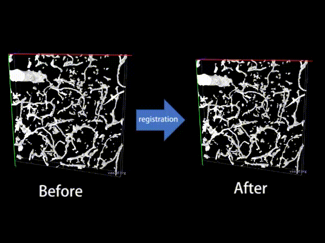

# 3D_registration
registration for time-lapse slipping of 3D image

To make above demo movie, the software 'Vaa3D' was used.

Peng, H., Ruan, Z., Long, F., Simpson, J.H., and Myers, E.W. (2010) "V3D enables real-time 3D visualization and quantitative analysis of large-scale biological image data sets," Nature Biotechnology, Vol. 28, No. 4, pp.348-353. (http://vaa3d.org)
Peng, H., Bria, A., Zhou, Z., Iannello, G., and Long, F. (2014) "Extensible visualization and analysis for multidimensional images using Vaa3D," Nature Protocols, Vol. 9, No. 1, pp. 193-208. (http://vaa3d.org)
Peng, H., et al. (2014) "Virtual finger boosts three-dimensional imaging and microsurgery as well as terabyte volume image visualization and analysis," Nature Communications, Vol. 5, No. 4342, DOI: 10.1038/ncomms5342.
Bria, A., et al. (2016) "TeraFly: real-time 3D visualization and 3D annotation of terabytes of multidimensional volumetric images," Nature Methods, Vol. 13, pp. 192-194, DOI: 10.1038/nmeth.3767.

## Dependencies
MATLAB

Image Processing Toolbox

Parallel Computing Toolbox

GPU and GPU driver is necessary in the computer.

## Author
Takehiro Ajioka 

E-mail:1790651m@stu.kobe-u.ac.jp

## Affiliation

Division of System Neuroscience, Kobe University of Graduate School of Medicine

神戸大学医学研究科システム生理学分野
